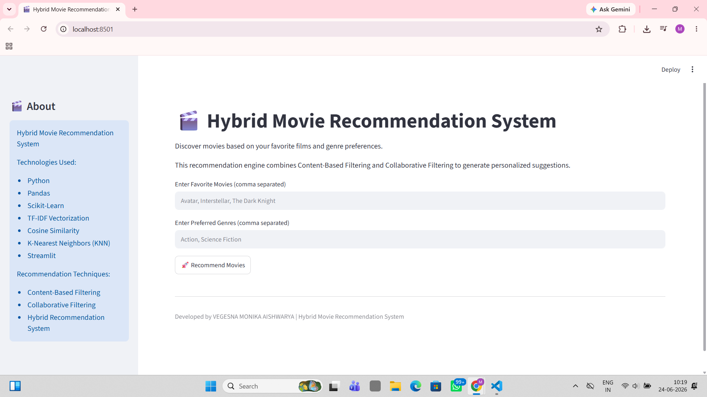
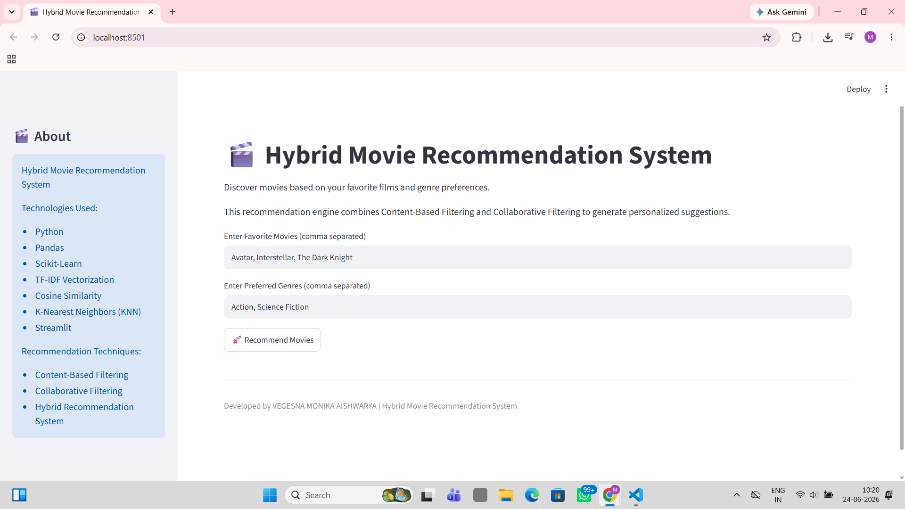
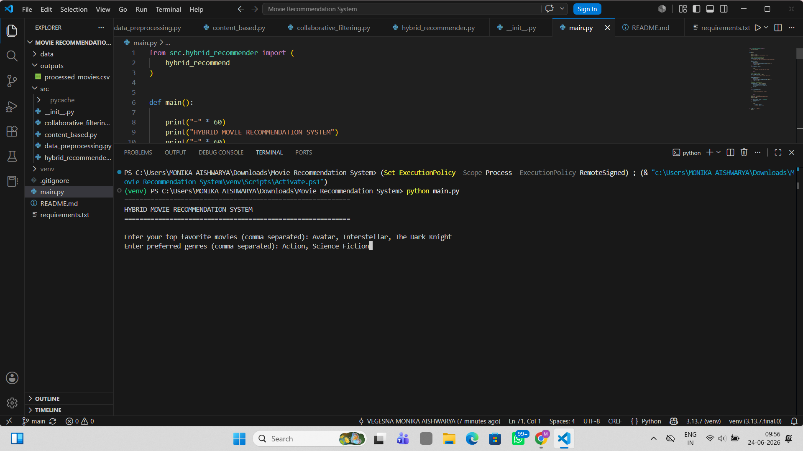
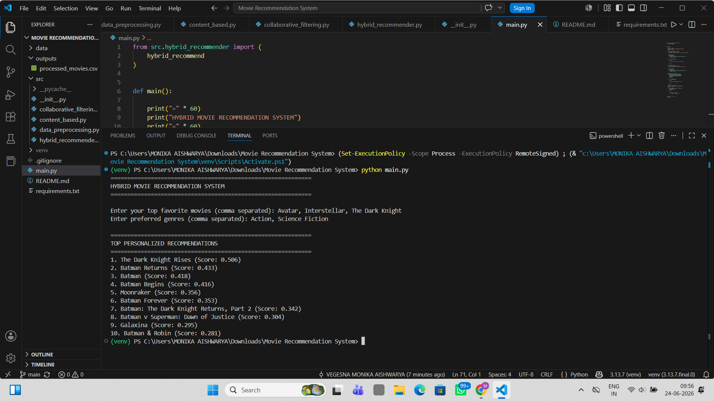

# 🎬 Hybrid Movie Recommendation System

## 📌 Project Overview

This project is a Hybrid Movie Recommendation System developed using Python and Scikit-learn. The system combines Content-Based Filtering and Collaborative Filtering techniques to generate personalized movie recommendations.

The recommendation engine analyzes movie metadata such as genres, keywords, cast members, directors, and movie descriptions using TF-IDF Vectorization and Cosine Similarity. It also leverages user rating behavior from the MovieLens dataset using K-Nearest Neighbors (KNN) to identify similar users and recommend movies based on collaborative preferences.

The hybrid approach improves recommendation quality by combining movie similarity with user behavior patterns.

---

## 🚀 Features

* Content-Based Movie Recommendations
* Collaborative Filtering using KNN
* Hybrid Recommendation Engine
* TF-IDF Vectorization
* Cosine Similarity Calculation
* Genre Preference Boosting
* Multiple Favorite Movie Inputs
* Personalized Movie Suggestions
* Movie Metadata Processing
* User-Based Recommendation Generation
* Streamlit Web Application Interface

---

## 📸 Application Screenshots

### Home Page



### User Input



### Recommendation Output - Part 1


### Recommendation Output - Part 2


### Recommendation Output - Part 3


### Recommendation Output - Part 4


### Recommendation Output - Part 5


### Terminal Input Example



### Terminal Output Example



---

## 📊 Datasets Used

### TMDB 5000 Movie Dataset

Used for Content-Based Filtering.

Files:

* tmdb_5000_movies.csv
* tmdb_5000_credits.csv

Contains:

* Movie Titles
* Genres
* Keywords
* Overview
* Cast Information
* Director Information

### MovieLens Dataset

Used for Collaborative Filtering.

Files:

* movies.csv
* ratings.csv

Contains:

* User Ratings
* Movie Information
* User-Movie Interactions

---

## 🧠 Content-Based Filtering

The Content-Based Recommendation module recommends movies similar to the user's favorite movies.

### Process

1. Merge TMDB Movies and Credits datasets.
2. Extract:

   * Genres
   * Keywords
   * Top Cast Members
   * Director
   * Movie Overview
3. Create a combined Tags feature.
4. Apply TF-IDF Vectorization on movie tags.
5. Calculate Cosine Similarity between movies.
6. Recommend movies with the highest similarity scores.

### Technologies Used

* Pandas
* Scikit-learn
* TF-IDF Vectorizer
* Cosine Similarity

---

## 👥 Collaborative Filtering

The Collaborative Filtering module recommends movies based on similar users' preferences.

### Process

1. Create a User-Movie Rating Matrix.
2. Fill missing ratings with 0.
3. Train a K-Nearest Neighbors (KNN) model.
4. Find users with similar rating behavior.
5. Identify highly-rated movies from similar users.
6. Recommend movies not yet watched by the target user.

### Technologies Used

* Pandas
* Scikit-learn
* Nearest Neighbors (KNN)

---

## 🔥 Hybrid Recommendation System

The Hybrid Recommendation System combines the strengths of Content-Based and Collaborative Filtering.

### Workflow

1. Generate recommendations using Content-Based Filtering.
2. Apply Genre Preference Boosting.
3. Generate recommendations using Collaborative Filtering.
4. Combine recommendation scores.
5. Rank movies based on final hybrid scores.
6. Return the top personalized recommendations.

### Advantages

* Better Personalization
* Reduced Cold-Start Limitations
* Improved Recommendation Accuracy
* More Diverse Movie Suggestions

---

## 🏗️ Project Structure

```text
Movie-Recommendation-System/
│
├── data/
│   ├── tmdb_5000_movies.csv
│   ├── tmdb_5000_credits.csv
│   ├── movies.csv
│   ├── ratings.csv
│
├── outputs/
│   └── processed_movies.csv
│
├── screenshots/
│   ├── app_home_page.png
│   ├── recommendation_input.png
│   ├── recommedation_output_1.png
│   ├── recommedation_output_2.png
│   ├── recommedation_output_3.png
│   ├── recommedation_output_4.png
│   ├── input.png
│   └── output.png
│
├── src/
│   ├── __init__.py
│   ├── data_preprocessing.py
│   ├── content_based.py
│   ├── collaborative_filtering.py
│   └── hybrid_recommender.py
│
├── app.py
├── main.py
├── requirements.txt
├── README.md
└── .gitignore
```

---

## ⚙️ Installation

### Clone Repository

```bash
git clone https://github.com/MonikaAishwarya/Movie-Recommendation-System.git
cd Movie-Recommendation-System
```

### Create Virtual Environment

```bash
python -m venv venv
```

### Activate Virtual Environment

Windows:

```bash
venv\Scripts\activate
```

Mac/Linux:

```bash
source venv/bin/activate
```

### Install Dependencies

```bash
pip install -r requirements.txt
```

---

## ▶️ How to Run

### Step 1: Generate Processed Dataset

```bash
python src/data_preprocessing.py
```

### Step 2: Run Command-Line Application

```bash
python main.py
```

### Step 3: Run Streamlit Web Application

```bash
streamlit run app.py
```

---

## 📈 Example Input

```text
Favorite Movies:
Avatar, Interstellar, The Dark Knight

Preferred Genres:
Action, Science Fiction
```

---

## 📈 Example Output

```text
TOP PERSONALIZED RECOMMENDATIONS

1. The Dark Knight Rises
2. Batman Returns
3. Batman
4. Batman Begins
5. Moonraker
6. Batman Forever
7. Batman: The Dark Knight Returns, Part 2
8. Batman v Superman: Dawn of Justice
9. Galaxina
10. Batman & Robin
```

---

## 🛠️ Technologies Used

* Python
* Pandas
* NumPy
* Scikit-learn
* Streamlit
* TF-IDF Vectorizer
* Cosine Similarity
* K-Nearest Neighbors (KNN)

---

## 📚 Key Concepts Implemented

* Recommendation Systems
* Content-Based Filtering
* Collaborative Filtering
* Hybrid Recommendation Systems
* Natural Language Processing (NLP)
* Feature Engineering
* TF-IDF
* Cosine Similarity
* KNN Algorithms
* Data Preprocessing

---

## 🔮 Future Improvements

* Movie Poster Integration using TMDB API
* Fuzzy Movie Search
* User Authentication System
* Recommendation Evaluation Metrics (RMSE, MAE)
* Deep Learning-Based Recommendations
* Real-Time Recommendation Updates
* Movie Popularity Ranking
* Advanced Hybrid Weight Optimization
* Interactive User Profiles

---

## 👩‍💻 Author

**VEGESNA MONIKA AISHWARYA**

Developed as a Machine Learning and Recommendation Systems project using Python, Scikit-learn, and Streamlit.
